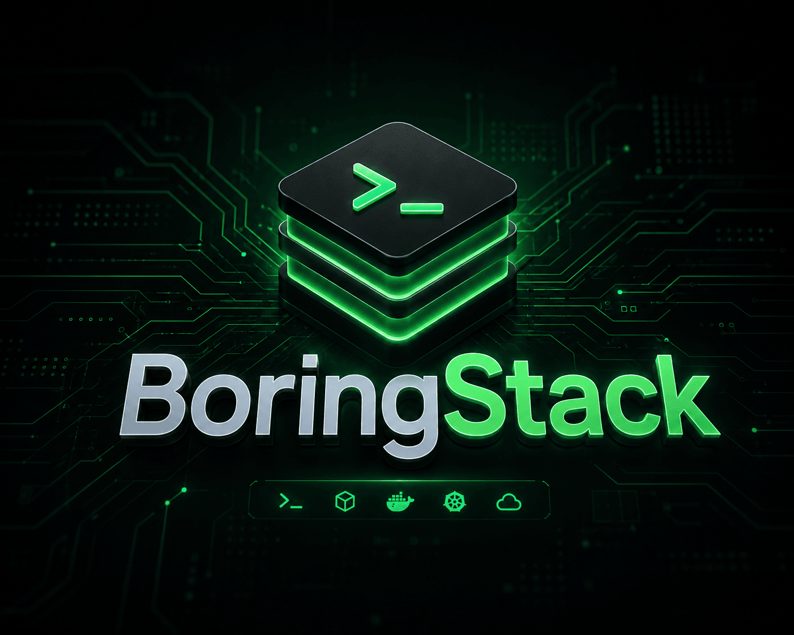

  

  
  
  

  
  
  
  
  
  
  

  <strong>Production-ready from the first fork.</strong> 
  One monorepo for the full stack.

  
  
  
  
  

Documentation lives at [boringstack.xyz](https://boringstack.xyz) — start with the [Quickstart](https://boringstack.xyz/quickstart/).

## License

MIT
